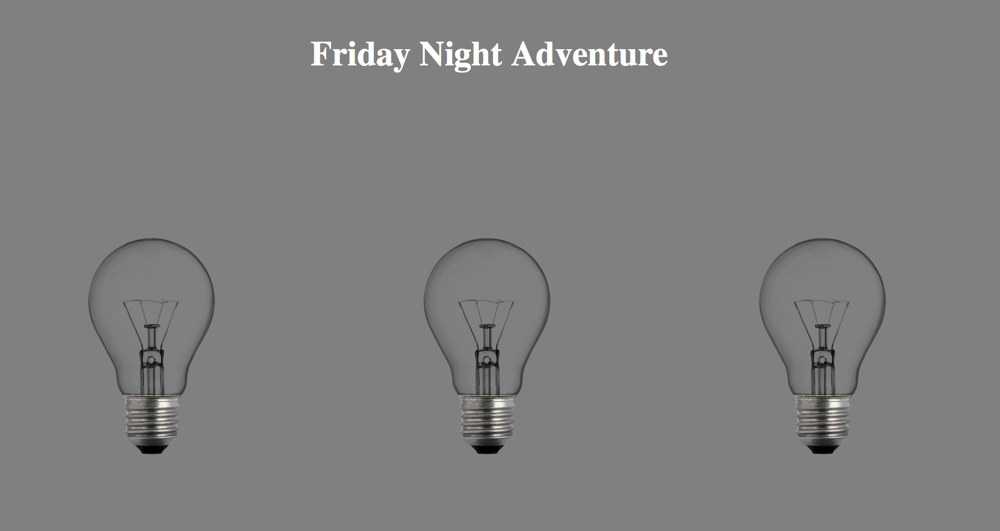
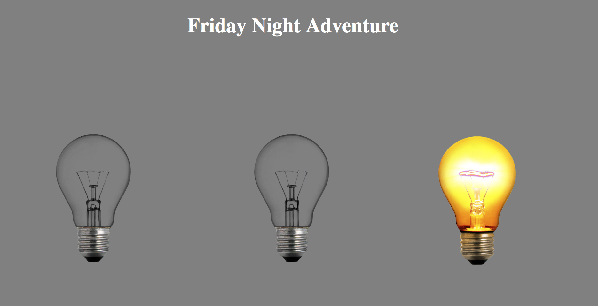

# Final Project Outline: Friday Night Adventure

## Overview

This project is consisted of 4 web page, 1 for navigation and three for different conditions. 

### Navigation Page
Navigation page will have three lightbulb on it, each of the lightbulb lead to a subpage. When you hover on the lightbult, it will be turn on and become slightly larger, and returns normal when you mouse out it. When you click on the light bulb, you will be redirect to the subpage accordingly.

### First Subpage
First Page will be in a party environment. At the center of the page, there will be a rotating sphere with texture, and this sphere will emit light intermittently. When it does not emit light, the human figure under it will only have a outline filled in black, when it emit light, the human figure will be revealed and toned by the color of the light. And at the left side of screen, there will be a button for user to add more people to the screen.

### Second Subpage
This webpage will be in a home environment. There will be a student sitting in the center of the screen, with the animation of textbook piling up. There is rest button where you can stop the piling action, but if you let the book fill to the top of the screen. The book will randomly fly over the screen and the person change into a angry person gif.

### Third Subpage
This webpage will be in a 3d enviroment with cube map texture and pixel manipulation. It's in your dream, a fantasy land where you can float around. You can choose what your cursor icon is on the left, and when you click on somewhere in the webpage, it will left the cursor image there. 

