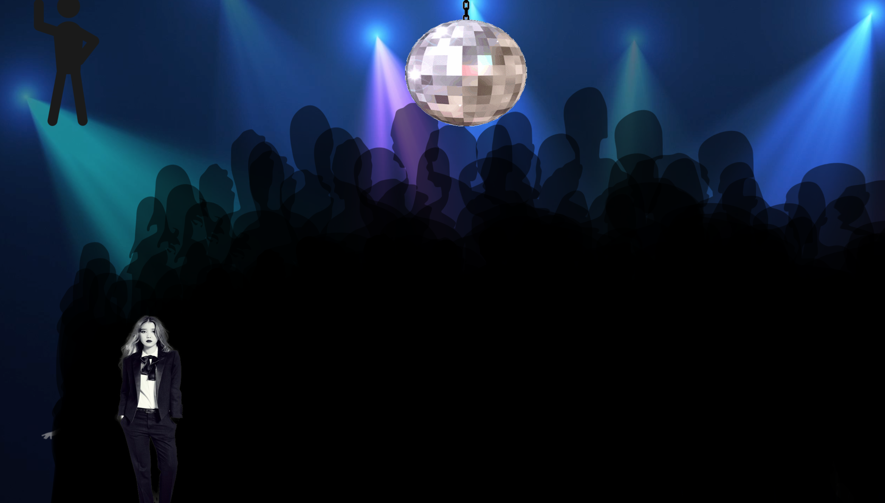

# Final Project Outline: Friday Night Adventure

## Overview

This project is consisted of 4 web page, 1 for navigation and three for different conditions. 

### Navigation Page
Navigation page will have three circles on it, each of the circlelead to a subpage. When you hover on the circles, it will stop spining and enlarge, and returns normal when you mouse out it. When you click on the circle, you will be redirect to the subpage accordingly. I made those three circles using div tag, and change the border radius of it to 100%, and add box shadow to it to make it looks better.

### First Subpage
First Page will be in a party environment. At first, this page will be in a black background, and at the center of the page, there will be a black spining light gif. When you click on the spinning light, it will be lighted and the background will change, the hidden party group will be shown. When you hover on the party group on the bottom of the screen, three figures will show up, and if you click on the figure, it will add more party groups, and when the party groups get too much, it will direct you automatically to the second web page. And on the upper left corner, there will be a icon that you can click on. When you click on the image, it will randomly create another figure for you, and you can click and drag the figure to move it. When you click on this newly added figure, it will also increase the party groups.

### Second Subpage
This webpage's theme is study. At the upper left part of the screen, there will be small frame inside which there are four emoji fly around. It basically means the distraction you will have during study. When you click on the emoji, it will randomly distributed more and more emoji on the screen, when the screen gets too crowed, all the emoji will disappear and a 'boom' image will show up. To contine, you will have to click on the boom image. And on the lower left part of the screen, there will be a lightbulb. When you hover on that lightbulb, it will be lighted, and when you click on it, books will be piled up upwards. And when books fill up the screen, a 'boom' image will show up and click on it will automatically direct you to the third web page.

### Third Subpage
This webpage will be in a 3d enviroment with cube map texture. It's in your dream, a fantasy land where you are floating around. The stick figure in this webpage has a phong material, which can reflect the light source around it. And there will be four lightballs floating around this stick figure, each of them emit light in different color, and has different size. I also add interactivity to those five object using Three.js projector. When you click on them, it will randomly change color, opacity and size.

 

